cs231n visual learning

[课程主页](http://cs231n.stanford.edu/)

[迁移学习的资料](https://github.com/artix41/awesome-transfer-learning#surveys)

[代码实现主要参考了](https://github.com/Halfish/cs231n)

## assignment1

#### 目标

- 了解基本的**图像分类管道**和数据驱动的方法（训练/预测阶段）
- 了解train / val / test **拆分**以及**超参数调整**的验证数据的使用。
- 提高用numpy 编写高效**矢量化**代码的熟练程度
- 实现并应用k-Nearest Neighbor（**kNN**）分类器
- 实现并应用多类支持向量机（**SVM**）分类器
- 实现并应用**Softmax**分类器
- 实现并应用**两层神经网络**分类器
- 理解这些分类器之间的差异和权衡
- 通过使用比原始像素**更高级别的表示**来获得对性能改进的基本理解（例如，颜色直方图，梯度直方图（HOG）功能

#### 环境

* python3.6+virtualenv+ipython


* [课程官方笔记总结及翻译](https://zhuanlan.zhihu.com/p/21930884)

### Q1-knn

#### 概念

* 分类时，对新的实例，根据其k个最近邻的训练实例的类别，通过多数表决等方式进行预测。
* 三要素：k值的选择；距离度量；分类决策规则

#### 数据集

- 数据集：CIFAR-10 

- Cifar-10 由60000张32*32的 RGB 彩色图片构成，共10个分类。50000张训练，10000张测试

  [对RGB通道的理解](https://blog.csdn.net/silence2015/article/details/53789748/)

> 数字图像的本质是一个多维矩阵 ；矩阵中的元素对应我们所说的像素（pixel），其值即该像素的灰度值，数值越大，像素的颜色越‘白/浅’；数值越小，像素的颜色越’黑/深

* 解压后可以看到有5个data_batch和1个test_batch

先缩减cifar10数据集,缩减后的数据集如下所示：

并分成4个数组：训练数据和标签，测试数据和标签  X_train,y_train,X_test,y_test


其中，3072=32\*32\*3

#### compute_distances_two_loops

* 这里使用L2距离

​       $L_2(x_i,x_j)=\sqrt{\sum\left|x^\left( l\right)_i-x^\left( l\right)_j\right|}$    

​       giving two images and representing them as vectors as $ x_i,x_j$

​       得到（500,5000）的dists

* L1,L2距离的讨论

#### predict_labels 

dists是500*5000的矩阵，表示500张测试图片每一张与5000张训练图片的距离

* 先用argsort求出dists中每行从小到大排列距离的下标

* 将前k个距离最小标签的存入closest_y

* **这k个样本中，对相同的label进行计算，数量最多的那个label作为对test样本的预测label**

  ```
  timeLabel = sorted([(np.sum(closest_y == y_), y_) for y_ in set(closest_y)])[-1]
  ```

#### faster

* one_loop  只用一层循环计算dists     

* no_loop  这里用了矩阵公式，展开平方距离公式，两个向量平方和+二倍乘积，最后开根号

* 三种循环方式时间比较 可见，使用numpy计算速度非常快

  

####交叉验证-选择合适K值

使用三切法，训练集，验证机，测试集。目的：避免过拟合 

**注：测试数据集只能使用一次，即在训练完成后评价最终的模型时使用。**

S折交叉验证：数据且分为S个互不相交大小相同的子集，S-1用于训练，剩下的测试，将这一过程对可能的S种选择重复进行。

代码中用的是五折交叉验证，两层循环，第一层k值，第二次S折，最后计算出不同K下的准确率，最后计算得到k=8是最优的，然后整合数据集，计算最终准确率。


#### 总结

* KNN不常用，效率低且基于像素比较的相似和感官上以及语义上的相似是不同的

* knn原理简单，但由于对numpy的不熟悉，在数据集的切割，计算上花了很多时间。


###Q2-SVM Q3-Softmax 

####线性分类器

使用linear classifier得到score

> W的每一行都是一个分类类别的分类器。对于这些数字的几何解释是：如果改变其中一行的数字，会看见分类器在空间中对应的直线开始向着不同方向旋转。而偏差b，则允许分类器对应的直线平移。需要注意的是，如果没有偏差，无论权重如何，在![[公式]](https://www.zhihu.com/equation?tex=x_i%3D0)时分类分值始终为0。这样所有分类器的线都不得不穿过原点。

> 可以认为是在**高效的使用knn**,不同的是我们没有使用所有的训练集的图像来比较，而是每个类别只用了一张图片（这张图片是我们学习到的，而不是训练集中的某一张），而且我们会使用（负）内积来计算向量间的距离，而不是使用L1或者L2距离。

####计算损失和梯度

svm和softmax只是计算loss和gradient的方式不同（ 见下图） 

* 从概率论的角度解释softmax,把结果看做是对每个类别预测分类的概率值

  > Li表示第i张图片的data loss， sj指第i张图片对第j类的score，syi指第i张图片所属正确类的score。这里的1其实是一个给定的delta值，也可以设为其他常数，delta的含义是正确类的score不仅理应比其他类的score高，而且应该高出delta，否则将产生data loss

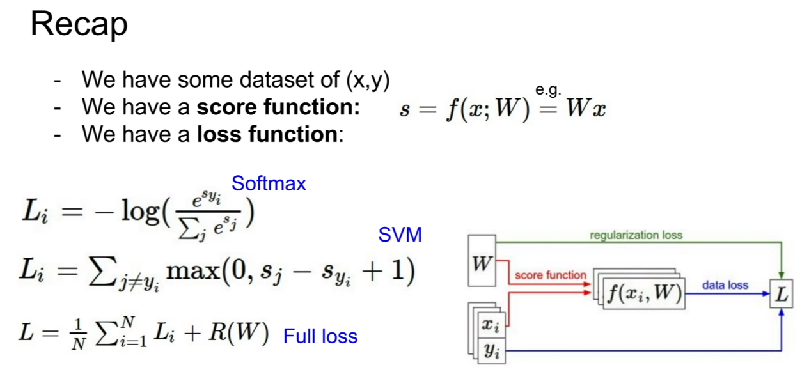

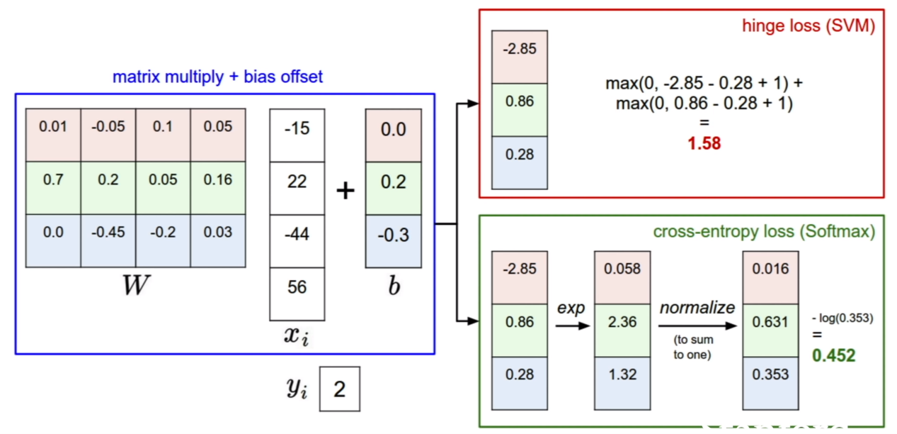

补充：$R(W) $指正则化，因为有时候多组W可以得到相同的loss

$R(W)=\sum_{k}\sum_{l}W^2_k,_l$

这里假设图像$x_i$只有四个像素，reshape成一个矢量，实际是32\*32\*3

* svm和softmax的梯度推导

  * svm

  

  * softmax

  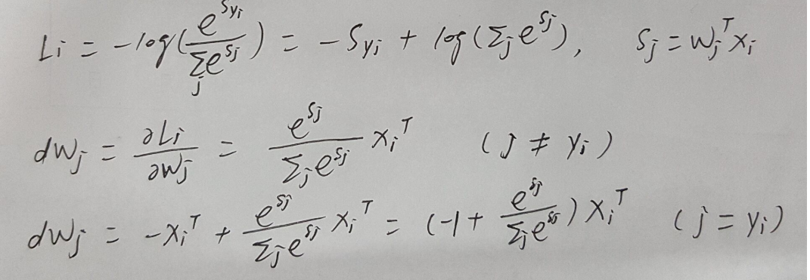


###Optimization

#### 梯度下降

想象成在下山的过程中寻找最低点，梯度指明了函数在哪个方向是变化率最大的，但是没有指明在这个方向上应该走多远。所以出现了步长，learning rate，走的太快容易陷入局部最优，走的慢效率低。

* 随机梯度下降 
* 跟随梯度下降：梯度是函数的斜率的一般化表达，它不是一个值，而是一个向量。当函数有多个参数的时候，我们称导数为偏导数。而梯度就是在每个维度上偏导数所形成的向量。
* 计算方法
  * 数值梯度法 ：使用有线差分公式近似计算梯度，计算数值梯度的复杂性和参数的量线性相关。在本例中有30730个参数，所以损失函数每走一步就需要计算30731次损失函数的梯度。
  * 分析梯度法

#### 反向传播

利用**链式法则**递归计算表达式的梯度的方法，反向传播使我们能够高效计算神经网络各个节点关于损失函数的梯度。代码可以看做两个部分：

* 完成表达式的前向传播 
* 对前向传播产生的每个变量进行回传 

写的时候要注意对前向传播变量进行缓存，在不同分支的梯度要相加，最好用数字注释下不同函数。

eg：

$ f(x,y)=\frac{(x+\sigma(y))}{(\sigma(x)+(x+y)^2)}$

$\sigma$ 是sigmoid激活函数

```python
x = 3 # 例子数值
y = -4

# 前向传播
sigy = 1.0 / (1 + math.exp(-y)) # 分子中的sigmoi          #(1)
num = x + sigy # 分子                                    #(2)
sigx = 1.0 / (1 + math.exp(-x)) # 分母中的sigmoid         #(3)
xpy = x + y                                              #(4)
xpysqr = xpy**2                                          #(5)
den = sigx + xpysqr # 分母                                #(6)
invden = 1.0 / den                                       #(7)
f = num * invden # 搞定！                                 #(8)
```

```python
# 回传 f = num * invden
dnum = invden # 分子的梯度                                         #(8)
dinvden = num                                                     #(8)
# 回传 invden = 1.0 / den 
dden = (-1.0 / (den**2)) * dinvden                                #(7)
# 回传 den = sigx + xpysqr
dsigx = (1) * dden                                                #(6)
dxpysqr = (1) * dden                                              #(6)
# 回传 xpysqr = xpy**2
dxpy = (2 * xpy) * dxpysqr                                        #(5)
# 回传 xpy = x + y
dx = (1) * dxpy                                                   #(4)
dy = (1) * dxpy                                                   #(4)
# 回传 sigx = 1.0 / (1 + math.exp(-x))
dx += ((1 - sigx) * sigx) * dsigx # Notice += !! See notes below  #(3)
# 回传 num = x + sigy
dx += (1) * dnum                                                  #(2)
dsigy = (1) * dnum                                                #(2)
# 回传 sigy = 1.0 / (1 + math.exp(-y))
dy += ((1 - sigy) * sigy) * dsigy                                 #(1)
# 完成! 嗷~~
```

####牛顿法和拟牛顿法

* 牛顿法：牛顿法相对于梯度下降（一阶）来说是用的二阶微分的手法，先进行二阶泰勒展开，然后迭代计算极小点。

  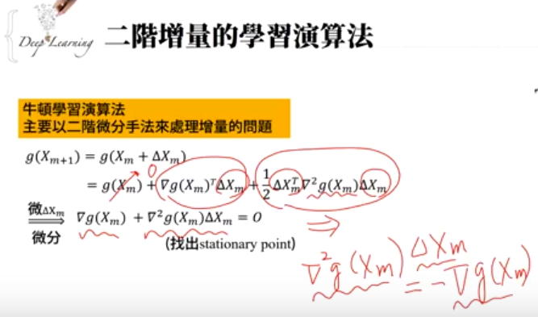

  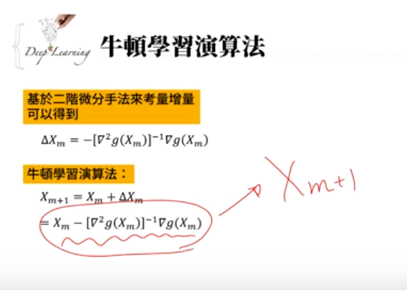

* 拟牛顿法：牛顿法的迭代中，需要每次都计算海塞矩阵的逆，比较复杂，考虑使用一个n阶矩阵近似代替海塞矩阵的逆。产生了两种优秀的算法：DFP,BFGS
* 相较于梯度下降来说，牛顿法可以一次到位，缺点是可能跳跃过快。具体内容可以看下数值计算方面的书

###Q4-Neural Network

####与线性分类器区别

一个两层的神经网络计算公式为：$s=W_2max(0,W_1x)$

重点就在于max函数，这是一个**非线性函数**(激活函数)，这里的作用是简单的设置阈值，将所有小于0的值变为0，$W_1$的大小为100*3072将图像x转换为一个100维的过渡向量，经过max的作用后，最终,$W_2$的大小为10 *100得到十个数字，可以解释为分类的评分,参数$W_1,W_2$将通过随机梯度下降来学习到，他们的梯度在反向传播过程中，通过链式法则来求导计算得出。

现代卷积神经网络能包含约1亿个参数，可由10-20层构成（这就是深度学习）。

神经网络可以近似任何连续函数。神经网络是一个**通用函数近似器**

如下所示：

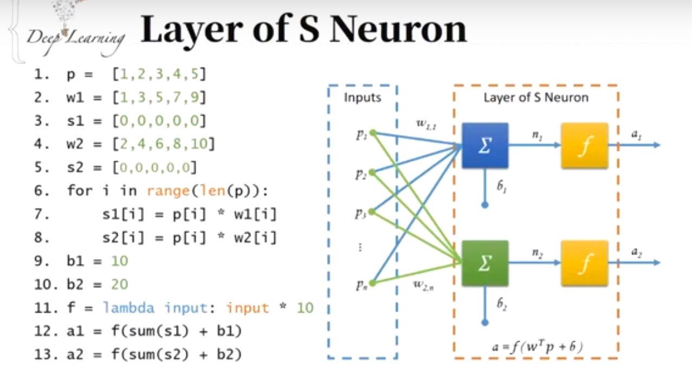

####各种激活函数

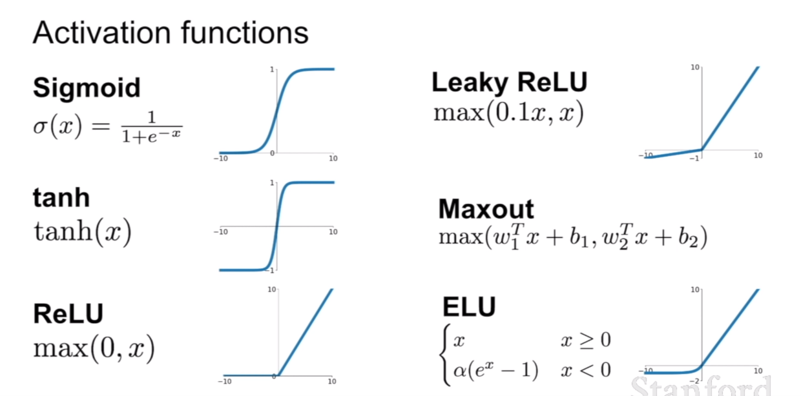

* sigmoid可以把值压缩在（0，1）缺点是函数饱和使梯度消失，输出不是零中心的
* tanh也存在饱和使梯度消失的问题
* ReLU近年比较流行，一是收敛速度快，二是计算简单，不需要计算指数等等，缺点是很多单元可能死掉。所以在使用它的时候要注意好调整你的学习率

####设置层的数量和尺寸

下面三幅图每个网络都只有一个隐层，但是神经元的数目不同。可以看到最右**过拟合**使得决策边界变成了许多不相连的区域 最左反而具有比较好的泛化能力 ，**正则化**是解决的好方法，正则化强度增加，决策边界变得更加平滑


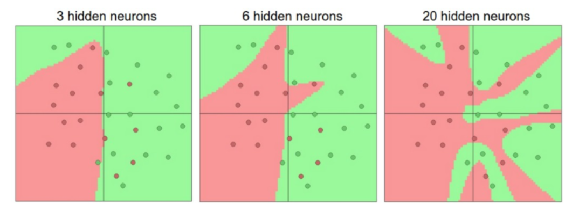

#### 数据预处理

数据预处理有很多种操作，均值减法，归一化，PCA，白化。在后面的卷积中用的最多的还是零中心化和归一化

#### 权重初始化

使用标准差为$\sqrt{2/n}$的高斯分布来初始化权重，其中![[公式]](https://www.zhihu.com/equation?tex=n)是输入的神经元数。例如用numpy可以写作：**w = np.random.randn(n) \* sqrt(2.0/n)**


#### 作业

* score_fuction 使用的是ReLu函数，公式为

  $s=W_2max(0,W_1X+b1)+b2$

  如果不用max函数，则每层的output都是下一个input的线性函数，则有无隐藏层效果一样，这里max实现了非线性转换。

* loss_fuction  这里用的softmax的损失函数 注意梯度的求解 可以参考前面的softmax.py

* Forward: 计算score，再根据score计算loss 
  Backward：分别对W2、b2、W1、b1求梯度（这里用的是**反向传播**，注意推导）

* training：根据求得梯度不断更新参数，训练模型，最终准确率只有28%左右

  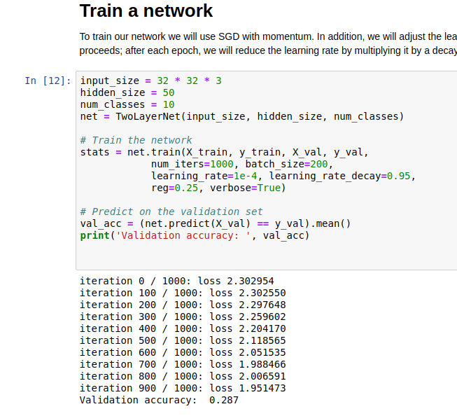

* 调整层数和步长，找到bestnet 

  

## CNN

####区别

* 传统的神经网络采用的是全连接

* CNN用的稀疏连接  **消除了大量不重要的连接** 每个神经元只需要负责处理一张图像的一个特定部分 结构如下：
  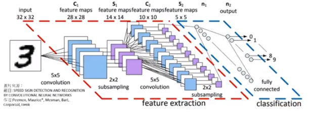

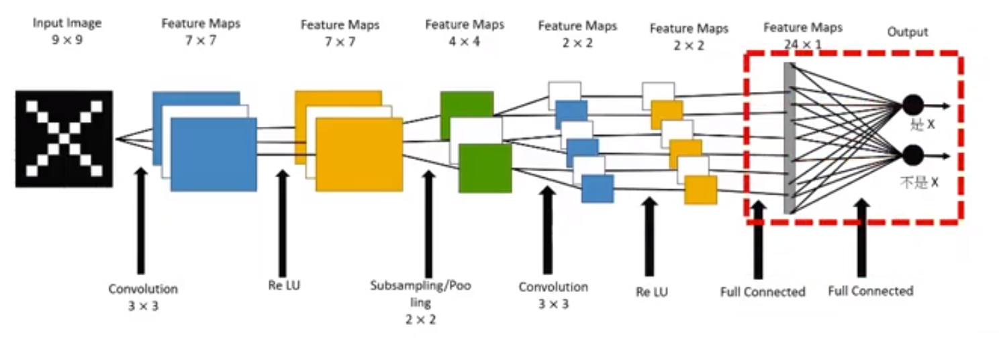

####层次结构

* convolution layer：提取特征 这里有一个stride（挪动）大小注意一下

* ReLU（线性整流）：去掉负向特征的干扰 相当于激活函数

* pooling：要注意window size，stride,padding的设定 其实就是在做一个压缩

* 最后将所有提取到的特征摊平，input到传统的neural network中

常见的cnn经典模型：Lenet，Alexnet，Googlenet，VGG，DRL 

####工具

* caffe：一个深度学习的框架，可以做CNN
* pytorch：
*  tensorflow


##迁移学习

####一些基本概念

* 迁移学习就是运用已有的知识来学习新的知识，核心是找到已有知识和新知识之间的**相似性**

> 迁移学习是机器学习领域用于解决**标记数据难获取**这一基础问题的重要手段

* 领域：由数据和生成数据的概率分布构成 ，分为源域（有标注）和目标域（无标注），不同领域有不同的概率分布
* 任务：学习的目标，包括标签和标签对应的函数
* 分类（by 杨强）

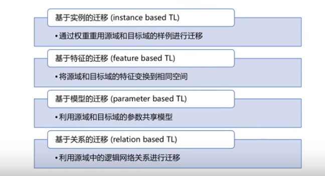

####领域自适应经典的方法

* 概率分布适配法（Distribution Adaptation）：最小化概率分布问题 这里我只看了下面这三个paper  [视频](https://www.youtube.com/watch?v=RbIsHNtluwQ) 里还介绍了非常多方法
  * TCA： [Domain Adaptation via Transfer Component Analysis](https://ieeexplore.ieee.org/abstract/document/5640675)  使用MMD
  
  * JDA ：[Joint Distribution Adaptation](http://openaccess.thecvf.com/content_iccv_2013/html/Long_Transfer_Feature_Learning_2013_ICCV_paper.html)  

    联合分布适配结果非常好
  
  * ARTL [adaption regularization](https://www.ntu.edu.sg/home/sinnopan/publications/[TKDE14]Adaptation%20Regularization%20A%20General%20Framework%20for%20Transfer%20Learning.pdf)
  
    分类器学习+联合分布适配
  
* 特征选择法(Feature Selection)：从源域和目标域中选择提取共享的特征，建立统一模型，通常与分布适配结合起来，选择特征常用稀疏矩阵

* 子空间学习法(Subspace Learning)：把两个域变换到相同的子空间

  * 统计特征变换
  * 流形学习

* 参考资料

  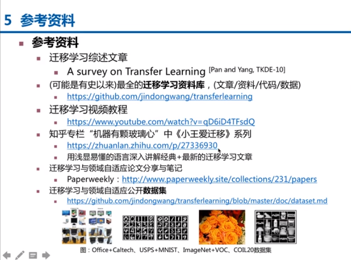

####动手实践

